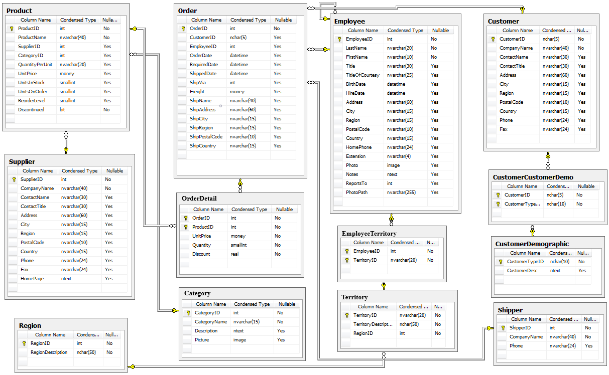
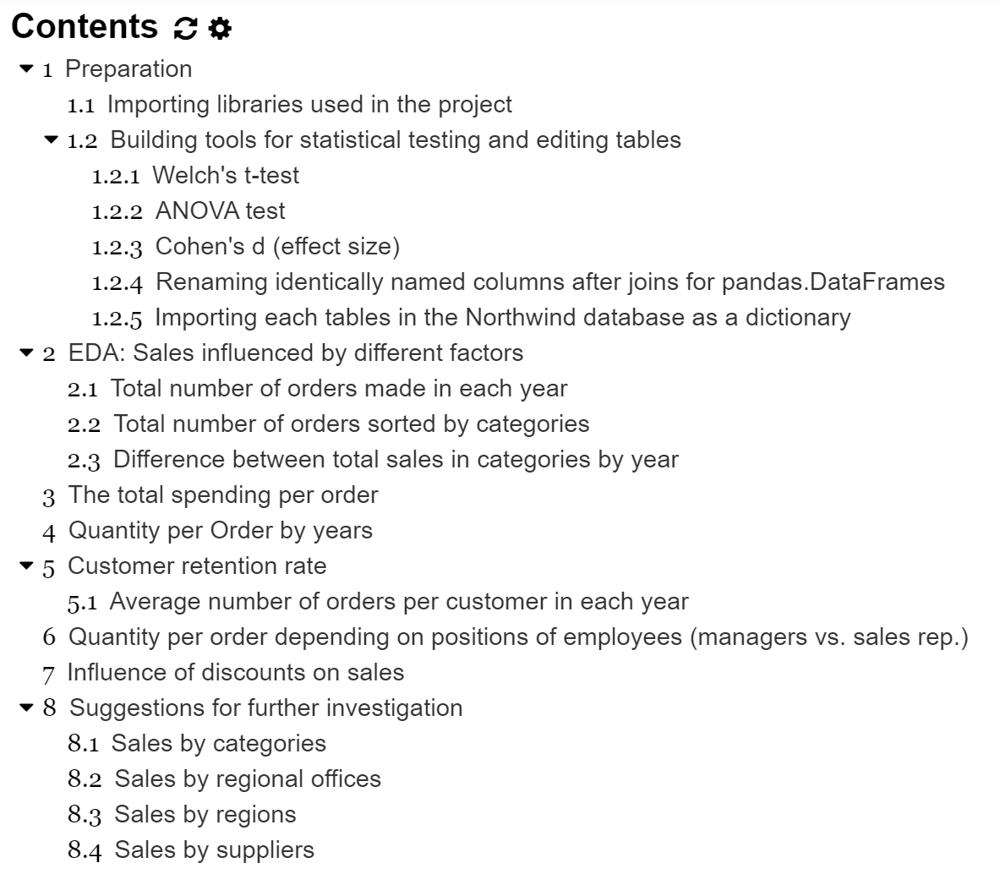

# NorthwindDatabase
This project is to explore Northwind database generated by Microsoft. It was the goal to practice critical thinking and conducting hypothesis tests to ask interesting question and answers that could be used in a business.

# What are in this repository?
* `index.ipynb` : a jupyter notebook file
* `Northwind_small.sqlite` : a reduced version of Northwind database
* `Northwind_ERD_updated` : a image file that includes the diagram for the database
* `Presentation_Northwind` : presentation slides that hightlight the results from this project

# Requirment
To be able to execute the codes in the jupyter notebook, make sure to install libraries listed in Importing libraries used in the project section in `index.ipynb`.  
**Note** 'pysqldf' is a function to use SQL query to manipulate pd.DataFrame using `pandasql.sqldf`.

# Table of contents

## Statistical tests and measuring effect sizes
In 1.2, there are three functions built to use three main statistical tools in this project; Welch's t-test, ANOVA, and Cohen's d. 

## DataFrame and SQL
Using pandas.DataFrame and SQL using sqlite3 library are big part of this project. 
* In 1.2.4, `rename_dup_columns(df)` is a function built to rename columns with identical name after joining multiple DataFrames. 
* In 1.2.5, the connection to the database was built and tables in the database was saved as a dictionary named `table_names`.

## Data Analysis 
Sections from 2 to 8, many aspects of the data were explored and hypothesis tests were conducted to find how the sales were made from 2012 to 2014 and what influenced the sales in this fictional company.

