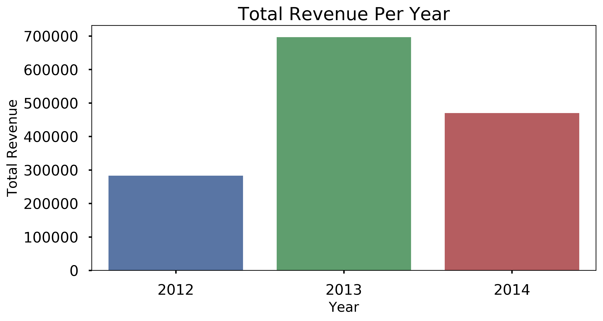
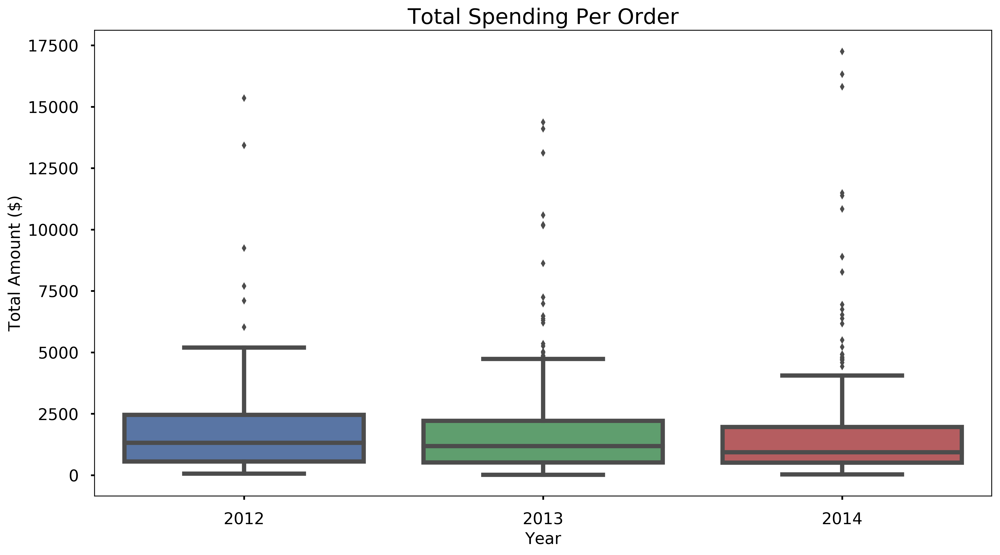
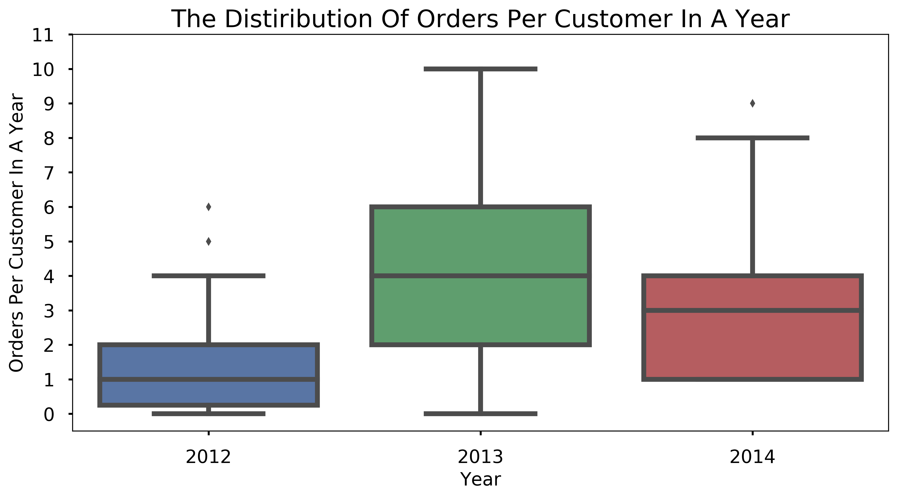
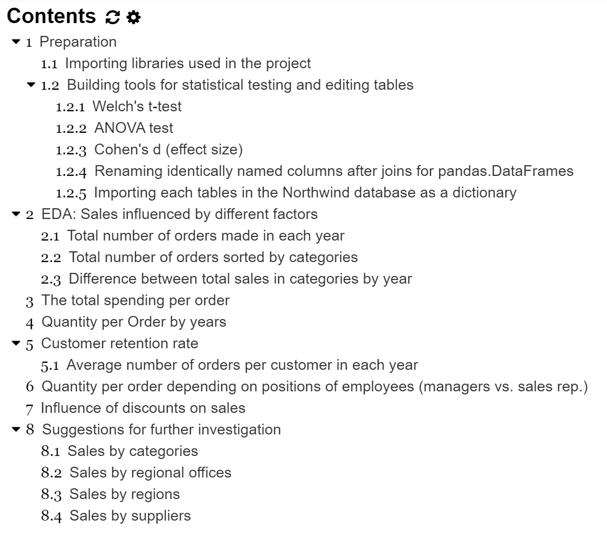

# Exploring Factors to Increase Sales using Hypothesis Testing

## About the project
There are many factors that change sales and total revenue per year for a business is one of the metrics that reflects overall how well the business have prospered in a year. When the total revenue of one year is increased compared to its previous year,  in overall, more purchases was made in the year than the year before. Increases in purchases could be one or more reasons from increases in customers, quantities, or numbers of orders per customer. Investigating the factors that affect the total revenue should be compared of changes between one year to another **in their averages** as we want to measure over all effect of each factor; therefore, we use the hypothesis testing methods.  In this project, different types of methods were used to investigate the factors that changed the total revenue over three years; 2012, 2013, and 2014 of an imaginary company named Northwind. 

### About the dataset
This project is to explore Northwind database generated by Microsoft. It is a `sqlite` file which is a relational database. As shown in the schematic diagram below, tables are related to one another. They were accessed and manipulated with the SQL language using `sqlite3` module. Also `pandasql.sqldf` module was used to use SQL syntax to query pandas DataFrame.

### Investigating the causes of the total revenue changes

The total revenue increased in 2013 compared to 2012 then decreased in 2014 although the total revenue in 2014 was higher than 2012. In order to find the driving force of this change, first we ask the following three questions.
**1.	Do customers spend more/ less per order from one year to the another?**

>The average values in spending amount per order from the data are $\$ 1862$, $\$1707$, and $\$1740$ for year 2012, 2013, and 2014 respectively. Using a statistical test called the ANOVA test, the differences in these values were not significant to conclude that the spending amount per order in average has changed; **customers have been spending consistent amount of money per order for those three years.** 

**2.	Do customers order more/ less quantity of a product per order?**

>The mean quantity per order values for those three years are 23.66, 24.07, and 23.5 units for year 2012, 2013, 2014 respectively. From the ANOVA test, the changes are not significant in these three years; **the quantity of items per order has not been changed over the years.** 

When both the amount of spending and quantity of item per order have been stable, what would have changed the total revenue? We check the number of ordered made in a year per customer.  

**3.	How many orders has each customer placed in each year?**

>Indeed, the average orders per client in each year are 1.73, 4.69, and 3.33 times per client in the year 2012, 2013, and 2014 respectively. The ANOVA test concluded that **there are significant changes in the frequency of orders per client in those three years.** Moreover, the Welch’s t-test confirms that **customers shopped less frequently in 2014 compared to in 2013.** These test results revealed that **one of the main factors that increased the total revenue from 2012 to 2013 than decreased in 2014 is the changes in the number of orders per customers in a year.** 

### Exploring a way to increase total revenue

Now with given data set, we can find a strategy that works to attract customers to order more. One thing that I found is the discounts. **Transactions are grouped by 6 different discount levels, 0% (no discount) to 25% with 5% increments and compared if the quantities per order has changed with varied discount level.** 
The ANOVA test confirmed that there is **a significant difference in the quantity per order when all six groups were compared together**. 

Moreover, when 5 groups with discounts(5% to 25%) with the group without discount were compared one by one, all five cases confirmed by Wech’s t-test that **there is a significant increase in quantity per order.** Interestingly, from calculating effect sizes between the discount groups with the no discount group (0% discount), **the amount of increase in quantity were similar with any discount from 5% to 25%.**

In the graph below, the effect size( a measure of the difference between two groups under observation) 0.35 interpreted that about 14% more customers would buy 6 units more with the discount and the 5% discount group has the effect size 0.35 calculated with the no discount group.

  

### What are in this repository?
* `index.ipynb` : The jupyter notebook file contain the data analysis and visualizations
* `Northwind_small.sqlite` : a reduced version of Northwind database
*  `images`: image folder that includes the diagram for the database and graphs 
* `Northwind_nontechnical_presentation` : presentation slides that summarize and highlight the results from this project

### Jupyter notebook file (`index.ipynb`)
#### Table of contents

#### Requirment
To be able to execute the codes in the jupyter notebook, make sure to install libraries listed in Importing libraries used in the project section in `index.ipynb`.  
**Note** `pysqldf` is a function to use SQL query to manipulate pd.DataFrame using `pandasql.sqldf`.

#### Statistical tests and measuring effect sizes
In 1.2, there are three functions built to use three main statistical tools in this project; Welch's t-test, ANOVA, and Cohen's d. 

#### DataFrame and SQL
Using pandas.DataFrame and SQL using sqlite3 library are big part of this project. 
* In 1.2.4, `rename_dup_columns(df)` is a function built to rename columns with identical name after joining multiple DataFrames. 
* In 1.2.5, the connection to the database was built and tables in the database was saved as a dictionary named `table_names`.

#### Data Analysis 
Sections from 2 to 8, many aspects of the data were explored and hypothesis tests were conducted to find how the sales were made from 2012 to 2014 and what influenced the sales in this fictional company.

